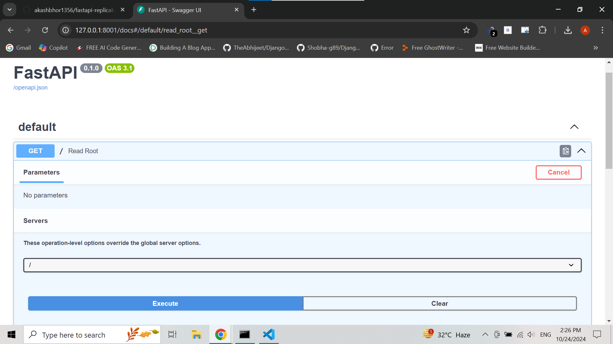
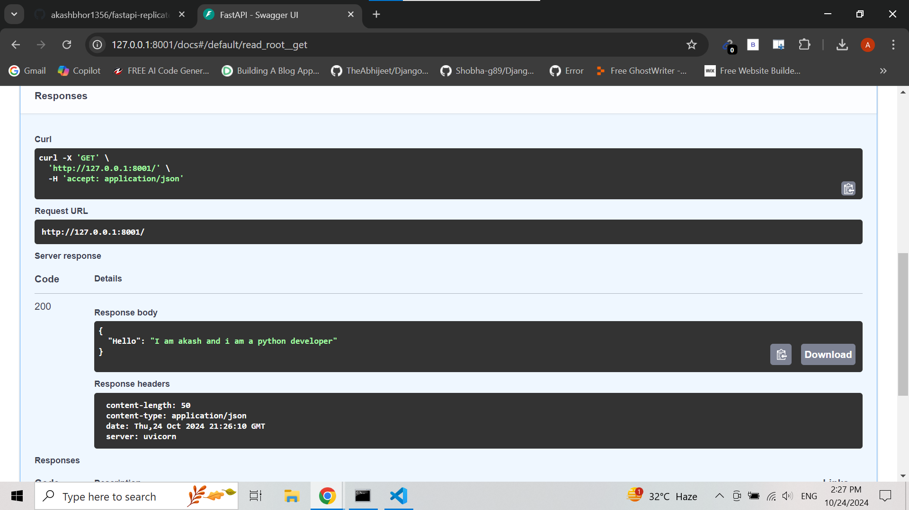

# FastAPI Replicate Image Generation API

## Description:
This FastAPI application interacts with Replicate's API to fine-tune and generate images based on a prompt. The application provides a clean and structured API with endpoints for generating images.

## UI Screenshots





## Setup:

1. Clone the repository.
2. Install the dependencies:
    ```bash
    pip install -r requirements.txt
    ```
3. Create a `.env` file with your Replicate API token:
    ```bash
    REPLICATE_API_TOKEN=your_replicate_api_token
    ```

4. Run the FastAPI application:
    ```bash
    uvicorn app.main:app --reload
    ```

## Endpoints:
- `POST /generate-image/`: Accepts a prompt and returns the generated image URL.

## Example Request:
```bash
curl -X 'POST' \
  'http://127.0.0.1:8000/generate-image/' \
  -H 'Content-Type: application/json' \
  -d '{"prompt": "sunset over mountains"}'
